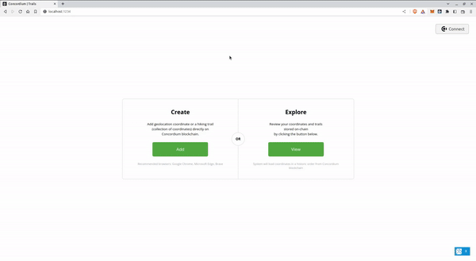

# CONCORDIUM HACKATON - TASK 3 - SUBMISSION

Mainnet address: 4csBZDoBmhtMmsq4dWTGdWowT7RMZtJJrEQGF5XHUKbuG4vAdZ

- Task1: https://github.com/sigrlami/ccdh/blob/sb/ccdh-task-1-submission/README.md
- Task2: https://github.com/sigrlami/ccdh/tree/sb/ccdh-task-2-submission

This is simple dAPP implemented in Elm which allows to create tourist routes that are stored on-chain. 





## Structure

- `app/frontend` - source code for Elm frontend that uses Javascript SDK for Concordium
- `contracts` - source code for Concordium smart-contracts that store data on-chain
- `media` - additional media files for better presentation

## Details

App can be viewable in 2 ways:

- `simple`   - (as shown in demo), allows to add and change data
- `extended` - visualize on-chain data

## Building

1. Prepare deployment package

```
$ cargo concordium build --schema-embed --schema-out schema.bin --out ccdh-geo.wasm.v1
```

2. Deploy package

```
$ concordium-client --grpc-ip node.testnet.concordium.com module deploy ccdh-geo.wasm.v1 --sender 3xyG4riNviVCGCsan9JWY5qsSbjju4nAgLKACcWYu9bovnL1Ak --name ccdh-geo-module
```

ref e13fb5b0f8525947a5a7dbf07cd131ea6b548321f18b3b930c5d130617aab45b

3. Generate base64 schema

```
$
```

4. Init

concordium-client --grpc-ip node.testnet.concordium.com contract init voting-contract-module --contract voting --parameter-json init-parameter.json --sender ACCOUNT_ADDRESS --energy 10000 --name voting-contract


````````
concordium-client --grpc-ip node.testnet.concordium.com contract init ccdh-geo-module --contract ccdh_tsk_3 --sender 3xyG4riNviVCGCsan9JWY5qsSbjju4nAgLKACcWYu9bovnL1Ak --energy 10000 --name ccdh-geo-contract


Transaction is finalized into block a8a4cd72200a96acf8ba5e5587cd7431d1c0ddf83d20d06a34d370d3286258c1 with status "success" and cost 2.467414 CCD (1371 NRG).
[17:00:28] Transaction finalized.
Contract successfully initialized with address: {"index":3437,"subindex":0}
Contract address {"index":3437,"subindex":0} was successfully named 'ccdh-geo-contract'.


``````````
